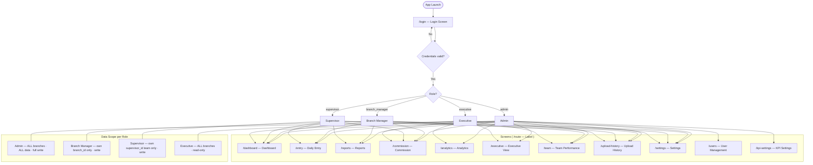
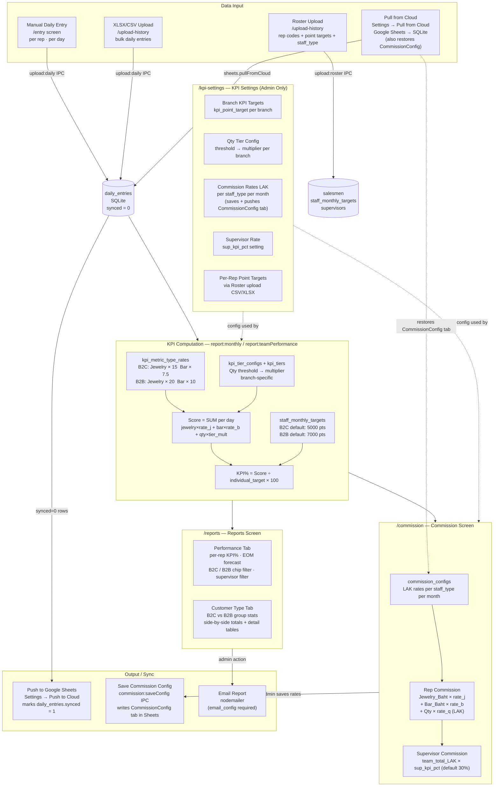

# KPV Sales Performance — System Flowcharts

> Version: **v1.3.1** — Update this header + diagram whenever app changes screens, roles, or data flow.

Paste each diagram block into [mermaid.live](https://mermaid.live) to render.

---

## Diagram 1 — User Roles & Screen Access Permissions

---

## Diagram 2 — Full Data Workflow

---

## Change Log

| Version | Date       | Change |
|---------|------------|--------|
| v1.3.1  | 2026-06-09 | Initial flowchart — B2C/B2B split, commission screen, customer type report, individual targets |
