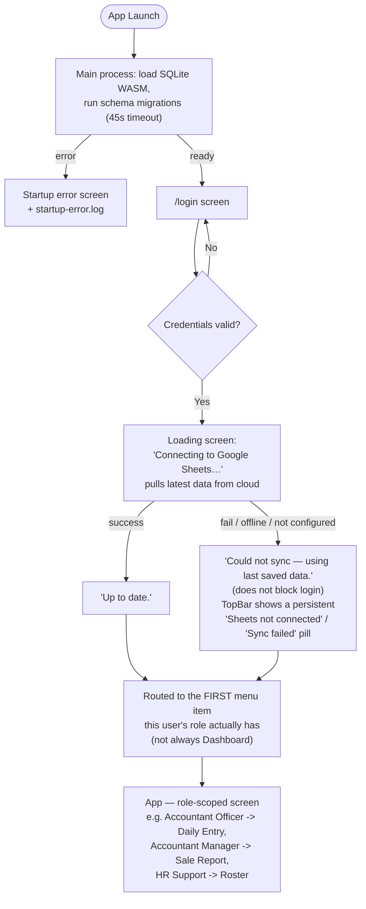
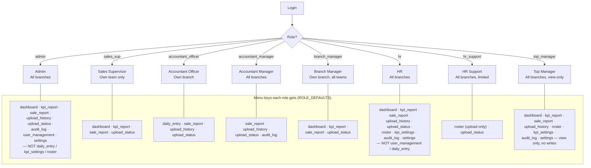
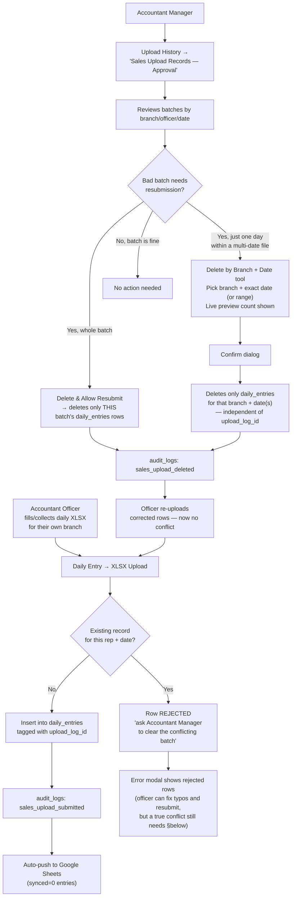
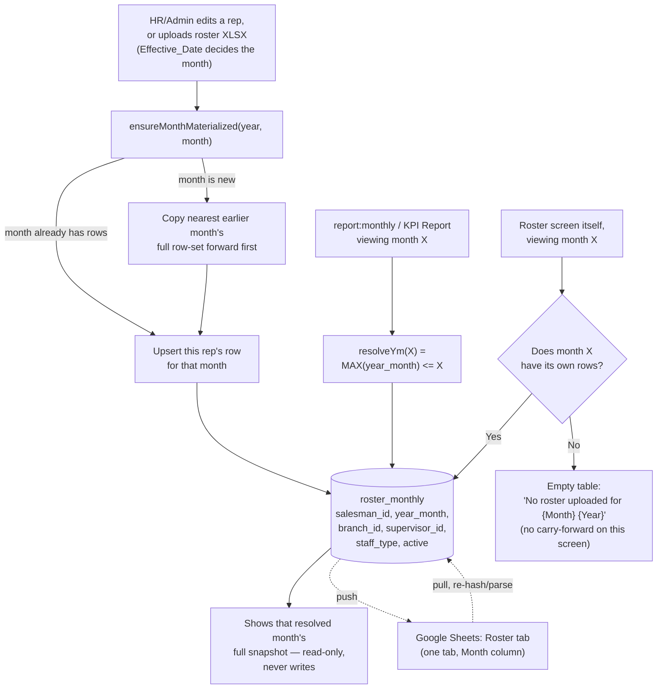
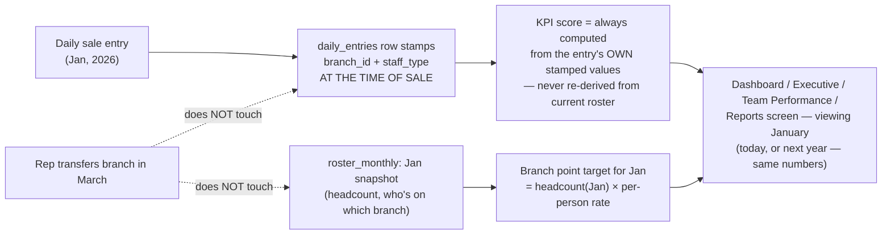
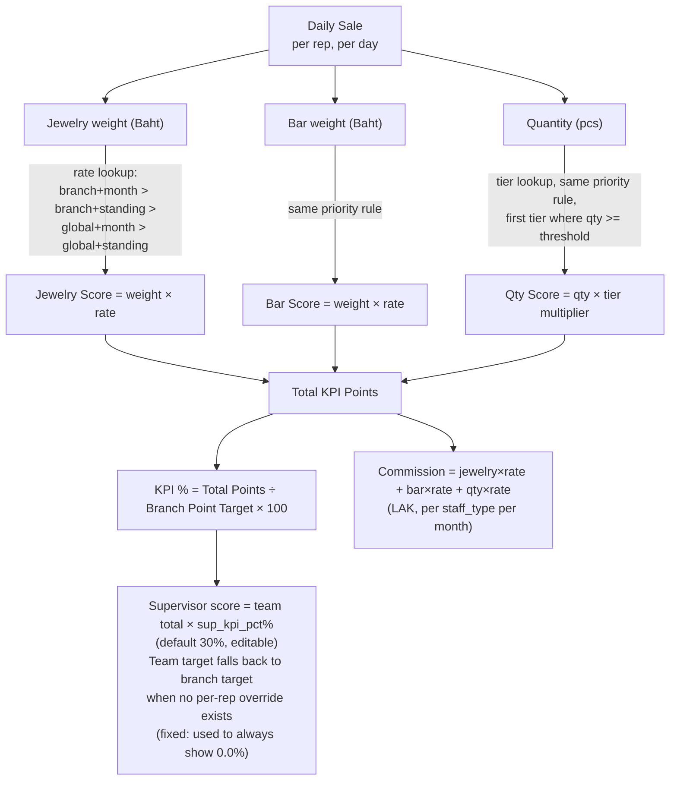

# KPV Sales Performance — System Flowcharts

> Version: **v1.7.88** — schema v20. Update this header + diagrams whenever app changes screens, roles, or data flow.

Paste each diagram block into [mermaid.live](https://mermaid.live) to render.

---

## Diagram 1 — Login & Startup Flow

Every login pulls fresh data first — a device that's been offline, or where someone else made a change on another device, never shows stale numbers without at least trying to catch up. The post-login landing screen is no longer hardcoded to Dashboard — roles without a Dashboard menu item (Accountant Officer, Accountant Manager, HR Support) used to silently land there anyway even though it wasn't in their sidebar; now they land on the first screen their own menu actually shows. The sync status pill (next to "Updated Xm ago", top-right of every screen) is visible to every role, so a device with no Settings access still gets a visible signal if sync isn't configured or last failed.

---

## Diagram 2 — User Roles & Screen Access

`ROLE_DEFAULTS` lives in **two places that must agree**: `src/types/index.ts` (frontend) and `electron/ipc/auth.ts` (backend — what actually gets enforced). Per-user overrides on top of these live in the `user_permissions` table, settable from User Management.

---

## Diagram 3 — Daily Sales Upload & Approval Workflow

Manual Entry was removed app-wide — Daily Entry is XLSX-upload-only now, for every role. The **Delete by Branch + Date** tool is separate from the per-batch **Delete & Allow Resubmit** button — it targets specific dates regardless of which uploaded file originally created those rows, useful when one uploaded file spanned many dates and only one day needs correcting.

---

## Diagram 4 — Roster: One Table, Carry-Forward by Month

A month nobody touched simply reads as whatever the last edited month said for every report/calculation — no "confirm this month, nothing changed" step. **The Roster screen's own display is the one exception**: it shows an exact-month-only view so HR can see at a glance whether a month was actually uploaded, instead of silently inheriting an older month's data. Deactivating/transferring a rep next month never changes how a past month's report reads (§ Diagram 5).

The Roster screen also has a **Sup tab** alongside the existing Reps tab — a read-only list of supervisors for the selected month (Sup Code, Name, Branch, Type, live Rep headcount, Target, Status), so HR can check both reps and supervisors are accounted for without leaving the screen. The Reps tab now also shows each rep's **Target** column (individual override if set, else branch+staff-type default), and the old "Show Inactive" toggle was removed — inactive reps are always hidden now.

---

## Diagram 5 — Why Past Reports Stay Stable Over Time

---

## Diagram 6 — KPI Scoring Engine

Editing a rate today never rewrites how a past month already scored — that's why rates/tiers are `year_month`/`effective_from`-`effective_to` scoped instead of one eternal value.

Clicking a rep or supervisor row on KPI Report opens a profile modal with a trend chart — one bar for Total Weight (Jewelry + Bar combined, grams) and one line for Quantity, in the same style regardless of which time view is selected (Month / Week / Day for reps; Month-only for supervisors). Month view previously showed a different chart shape (separate Jewelry/Bar bars plus a KPI% line) — now consistent across all views.

---

## Change Log

| Version | Date | Change |
|---------|------|--------|
| v1.3.1–v1.3.7 | 2026-06-06 to 09 | Original 4-role design — superseded, see below |
| v1.7.x | 2026-06-17 | 8-role redesign (admin/sales_sup/accountant_officer/accountant_manager/branch_manager/hr/hr_support/top_manager); Manual Entry removed; sales-upload approval workflow added |
| v1.7.x | 2026-06-17 | Roster redesigned to single `roster_monthly` table with carry-forward reads, replacing 3-table event-sourced design |
| v1.7.40 | 2026-06-17 | `report:monthly` fixed to resolve reps/branch/target as-of the viewed month (was reading live roster — drifted when reps transferred/deactivated) |
| v1.7.41 | 2026-06-17 | Login now pulls from Google Sheets before entering the app, with a loading screen |
| v1.7.x | 2026-06-18/19 | Roster screen: added Sup tab, Target column on Reps tab, removed Show Inactive toggle, month filter no longer carries data forward (exact-month-only display) |
| v1.7.x | 2026-06-18/19 | Upload History: added "Delete by Branch + Date" tool with live preview count, separate from per-batch Delete & Allow Resubmit |
| v1.7.x | 2026-06-18/19 | Audit Log now also records Roster, KPI Settings, Commission config, and Supervisor changes |
| v1.7.x | 2026-06-18/19 | KPI Report profile modal: trend chart unified to one Total Weight bar + one Quantity line across all time views; fixed Supervisor Team KPI % always showing 0.0% |
| v1.7.x | 2026-06-18/19 | Post-login landing page now routes to the first menu item the user's role actually has, instead of always defaulting to Dashboard |
| v1.7.x | 2026-06-18/19 | Sync status pill added next to "Updated Xm ago" on every screen, visible to all roles, for "not configured" / "last sync failed" |

*Diagrams older than v1.7.x described a 4-role system (admin/branch_manager/supervisor/executive) and Manual Entry — fully replaced, kept only in version history above for context.*
