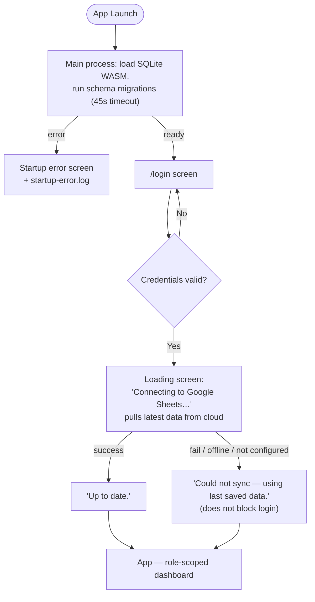
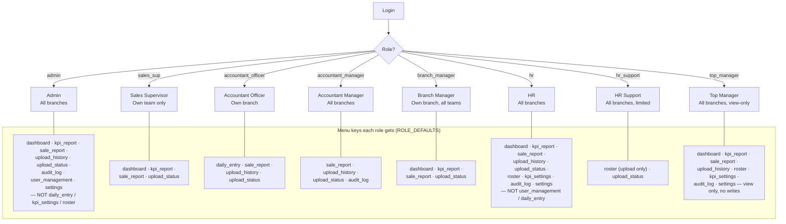
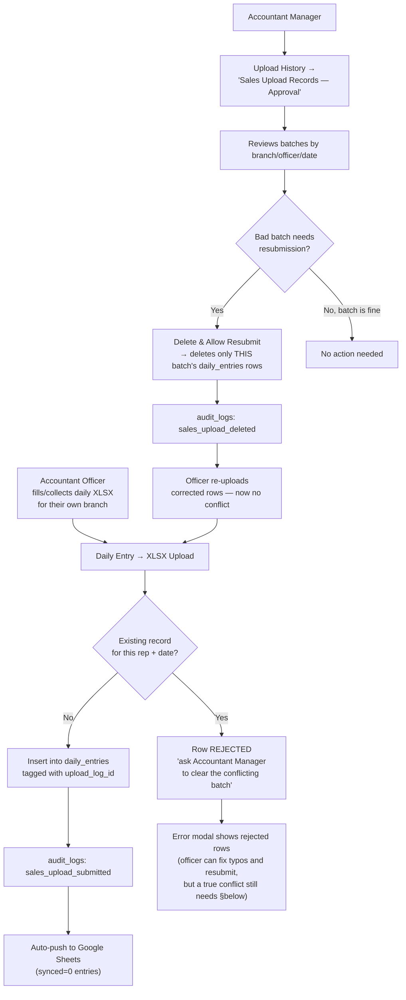
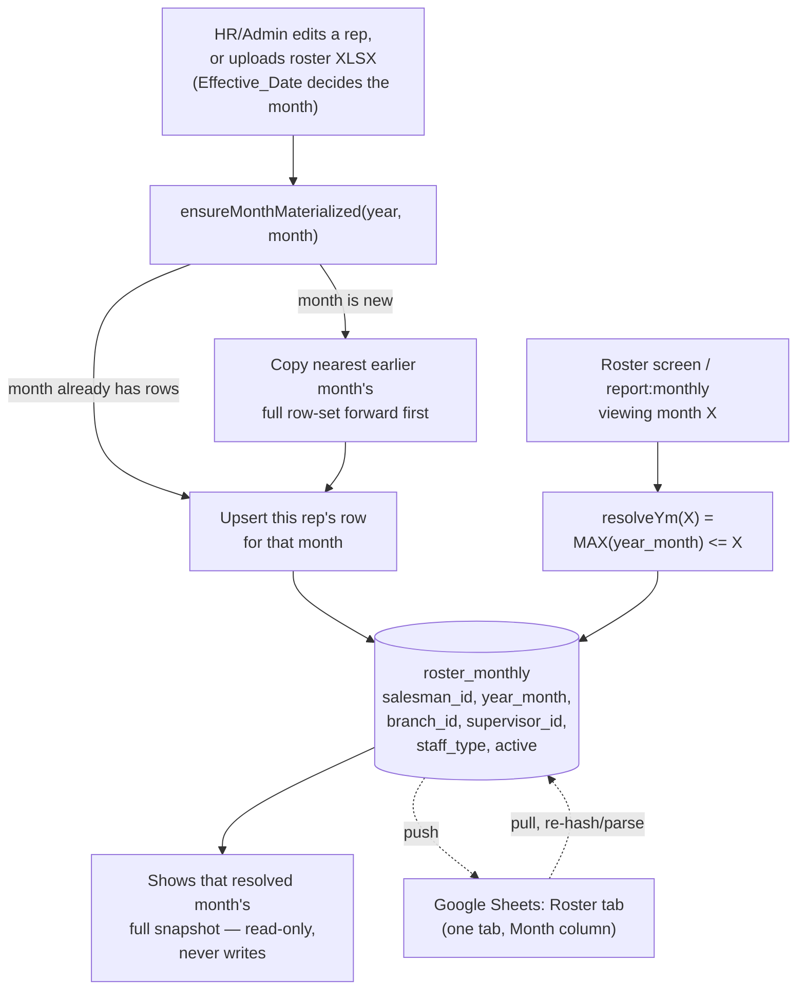
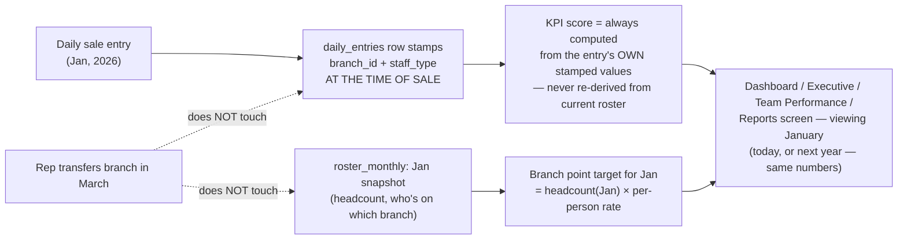
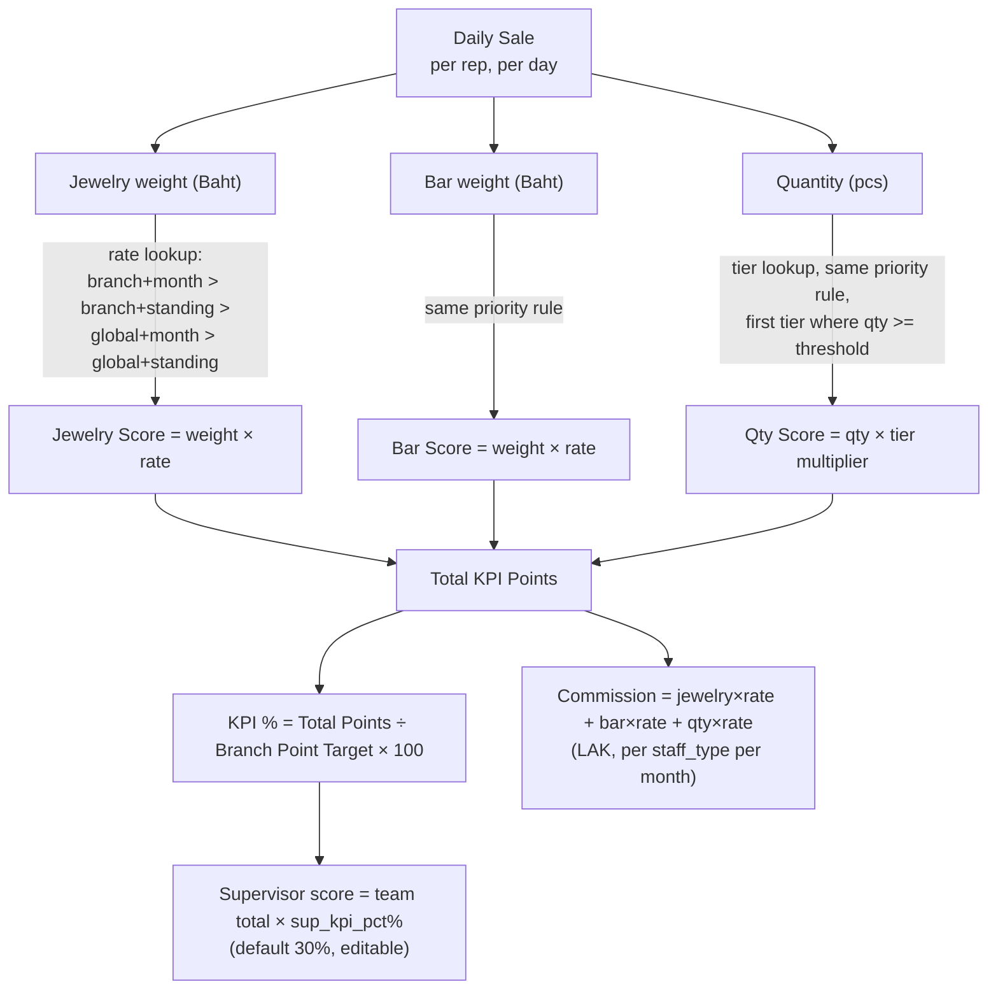

# KPV Sales Performance — System Flowcharts

> Version: **v1.7.41** — schema v20. Update this header + diagrams whenever app changes screens, roles, or data flow.

Paste each diagram block into [mermaid.live](https://mermaid.live) to render.

---

## Diagram 1 — Login & Startup Flow

Every login pulls fresh data first — a device that's been offline, or where someone else made a change on another device, never shows stale numbers without at least trying to catch up.

---

## Diagram 2 — User Roles & Screen Access

`ROLE_DEFAULTS` lives in **two places that must agree**: `src/types/index.ts` (frontend) and `electron/ipc/auth.ts` (backend — what actually gets enforced). Per-user overrides on top of these live in the `user_permissions` table, settable from User Management.

---

## Diagram 3 — Daily Sales Upload & Approval Workflow

Manual Entry was removed app-wide — Daily Entry is XLSX-upload-only now, for every role.

---

## Diagram 4 — Roster: One Table, Carry-Forward by Month

A month nobody touched simply reads as whatever the last edited month said — no "confirm this month, nothing changed" step. Deactivating/transferring a rep next month never changes how a past month's report reads (§ Diagram 5).

---

## Diagram 5 — Why Past Reports Stay Stable Over Time

---

## Diagram 6 — KPI Scoring Engine

Editing a rate today never rewrites how a past month already scored — that's why rates/tiers are `year_month`/`effective_from`-`effective_to` scoped instead of one eternal value.

---

## Change Log

| Version | Date | Change |
|---------|------|--------|
| v1.3.1–v1.3.7 | 2026-06-06 to 09 | Original 4-role design — superseded, see below |
| v1.7.x | 2026-06-17 | 8-role redesign (admin/sales_sup/accountant_officer/accountant_manager/branch_manager/hr/hr_support/top_manager); Manual Entry removed; sales-upload approval workflow added |
| v1.7.x | 2026-06-17 | Roster redesigned to single `roster_monthly` table with carry-forward reads, replacing 3-table event-sourced design |
| v1.7.40 | 2026-06-17 | `report:monthly` fixed to resolve reps/branch/target as-of the viewed month (was reading live roster — drifted when reps transferred/deactivated) |
| v1.7.41 | 2026-06-17 | Login now pulls from Google Sheets before entering the app, with a loading screen |

*Diagrams older than v1.7.x described a 4-role system (admin/branch_manager/supervisor/executive) and Manual Entry — fully replaced, kept only in version history above for context.*
