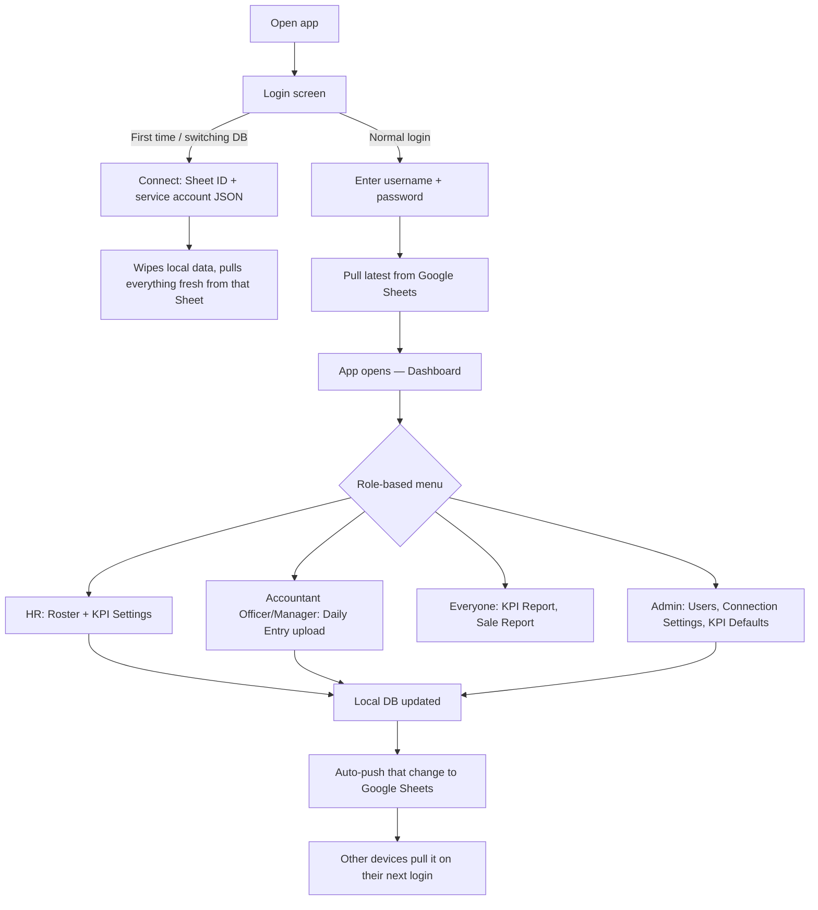

# 1. Overall App Working Process

SalesTrack Pro is an offline-first Electron app. Every device keeps a full local copy of
the data (SQLite via sql.js) and syncs with one shared Google Sheet. The app always works
even with no internet — it just won't see other devices' changes until the next sync.

## High-level flow

## The data lifecycle, in one sentence

**HR/Accountant/Admin enter data locally → it auto-pushes to the shared Google Sheet → every
other device pulls it down the next time someone logs in there.** Nothing is calculated on
the Sheet itself — the Sheet is just the shared storage; all KPI math happens inside the app,
locally, from whatever's in the local database at that moment.

## Why month-by-month matters

The app never asks "what does the roster look like right now" — it asks "what did the roster
look like **as of May**" (or whichever month a report is for). Every upload (Roster, KPI
Settings, Commission) is stamped with the month it applies to, and old months are never
overwritten by a newer upload. This is what makes historical reports stay accurate even
after staff transfer branches, rates change, or new reps join.

## The 3 inputs every KPI number depends on

1. **Roster** (who works where, for which branch, B2C or B2B, under which supervisor) — as of
   that month.
2. **KPI Settings** (Jewelry/Bar point rates, Qty tier multipliers, branch point targets,
   commission rates) — as of that month.
3. **Daily Entry** (actual Jewelry/Bar weight and Qty sold, per rep, per date).

KPI % for any month = combine all three for that exact month. Change any one of them for a
past month, and only that month's number changes — nothing else shifts.

## Where the data physically lives

| Layer | What it is | Survives app close? | Shared across devices? |
|---|---|---|---|
| Local SQLite (sql.js) | The real working database | Yes | No — one file per device |
| Google Sheet | The shared mailbox between devices | Yes | Yes |
| In-memory React state | What's on screen right now | No | No |

The Sheet is never read directly by reports — it only exists to carry data between devices.
Every calculation reads the local database.
