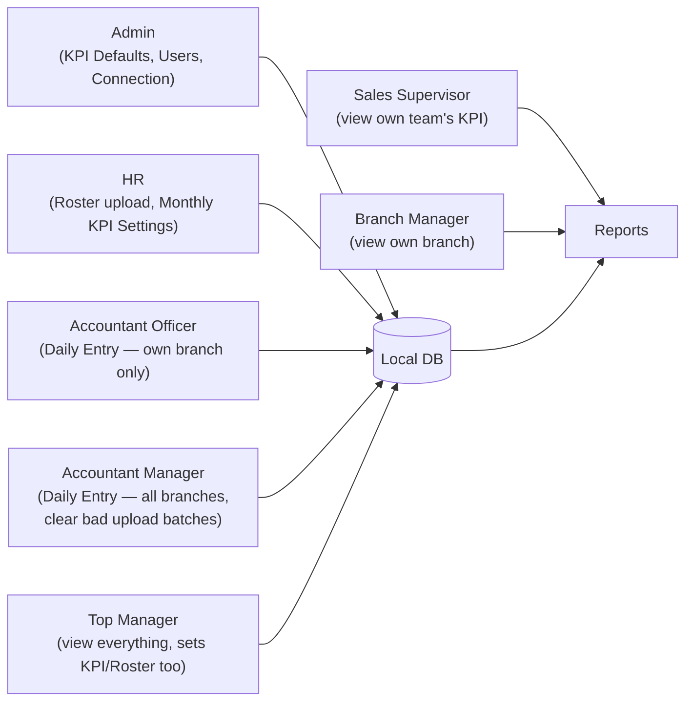

# 2. User Roles & Permissions

8 roles exist. Every role has a **default menu set** — Admin can override any individual
user's menu access on top of the default, per-user, via Settings → Users → the key icon.

## Role → default menu access

| Menu | Admin | HR | HR Support | Accountant Officer | Accountant Manager | Sales Supervisor | Branch Manager | Top Manager |
|---|---|---|---|---|---|---|---|---|
| Dashboard | ✅ | ✅ | — | — | — | ✅ | ✅ | ✅ |
| Daily Entry Upload | — | — | — | ✅ | — | — | — | — |
| KPI Report | ✅ | ✅ | — | — | — | ✅ | ✅ | ✅ |
| Sale Report | ✅ | ✅ | — | ✅ | ✅ | ✅ | ✅ | ✅ |
| Upload History | ✅ | ✅ | — | ✅ | ✅ | — | — | ✅ |
| Upload Status | ✅ | ✅ | ✅ | ✅ | ✅ | ✅ | ✅ | — |
| Roster | — | ✅ | ✅ | — | — | — | — | ✅ |
| KPI Settings | ✅ | ✅ | — | — | — | — | — | ✅ |
| Audit Log | ✅ | ✅ | — | — | ✅ | — | — | ✅ |
| User Management | ✅ (in Settings) | — | — | — | — | — | — | — |
| Settings | ✅ | ✅ | — | — | — | — | — | — |

(Settings appearing for HR/Top Manager is the Connection Settings + Users tab combo — Users
tab specifically is gated separately and normally Admin-only in practice.)

## What each role actually does

## Role-by-role responsibility

- **Admin** — owns the connection to Google Sheets, owns User accounts, owns **KPI Defaults**
  (the standing rates/tiers/targets/commission every month falls back to if HR forgets to set
  that month specifically). Does **not** do monthly KPI setup or daily data entry.
- **HR** — owns the Roster (who works where, monthly) and **monthly KPI Settings**
  (confirms/adjusts each month's rates, tiers, targets, commission — even if nothing changed
  from last month, HR must click Save to mark the month confirmed).
- **HR Support** — Roster-only, no KPI Settings access. For someone who just helps maintain
  staff lists without touching scoring rules.
- **Accountant Officer** — uploads Daily Entry (Jewelry/Bar/Qty sales) for **their own branch
  only**. Cannot see or upload another branch's reps. Cannot fix a wrong upload themselves —
  must ask an Accountant Manager to clear it first.
- **Accountant Manager** — same daily upload power as Officer, but **across every branch**,
  plus the power to **delete an upload batch** to let an Officer (or themselves) re-upload a
  corrected file.
- **Sales Supervisor** — views their own team's dashboard and KPI report. No edit access.
- **Branch Manager** — views their own branch's reports. No edit access.
- **Top Manager** — sees everything across all branches, and also has Roster + KPI Settings
  access (a Top Manager can act like HR if needed).

## Hard-coded safety accounts

- The **`admin`** username can never be deleted or locked out — every "wipe local data"
  operation in the app explicitly preserves this one account.
