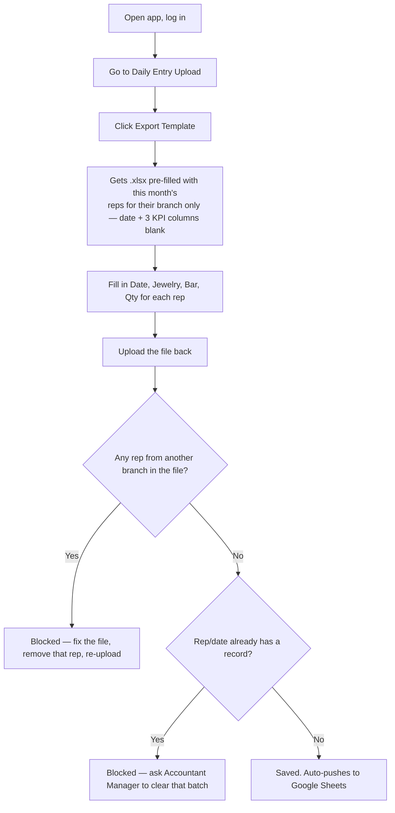
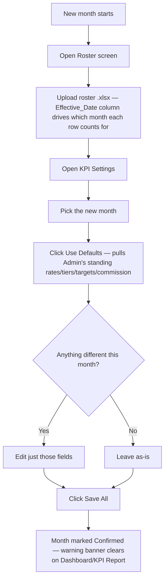

# 3. Daily / Monthly Routine, By Role

## Accountant Officer — every working day

## Accountant Manager — as needed (daily oversight + fixing mistakes)

1. Same upload flow as Officer, but the exported template includes **every branch's** reps
   in one file — can upload sales for any branch.
2. If an Officer made a mistake (wrong file, wrong numbers): go to Upload History, find their
   batch, **delete it**. This re-opens those exact rep/date rows for re-upload.
3. Periodically check Audit Log for unexpected `sales_upload_deleted` events.

## HR — once a month (start of the new month, before anyone uploads anything else)

**Important: HR must do this every month, even if nothing changed.** Skipping it leaves the
month "Not Confirmed" — numbers still calculate fine (using the last known values), but the
banner stays up until HR explicitly confirms that month.

## Admin — rarely (only when defaults genuinely need to change)

1. KPI Settings (Admin's view shows **Defaults**, not a month) → adjust the standing
   Jewelry/Bar rates, Qty tiers, Branch targets, or Commission rates that every new month
   will inherit unless HR overrides that month specifically.
2. Settings → Users → create/deactivate accounts, fix permissions, or permanently delete a
   user (only allowed if that user has no upload history on record).
3. Settings → Connection Settings → only touched when actually switching which Google Sheet
   this device points at (Test vs Production) — this is destructive (wipes local data first),
   gated behind the password prompt.

## Everyone else (Supervisor, Branch Manager, Top Manager) — whenever they want

Just open Dashboard / KPI Report / Sale Report. No data entry responsibility — read-only.
