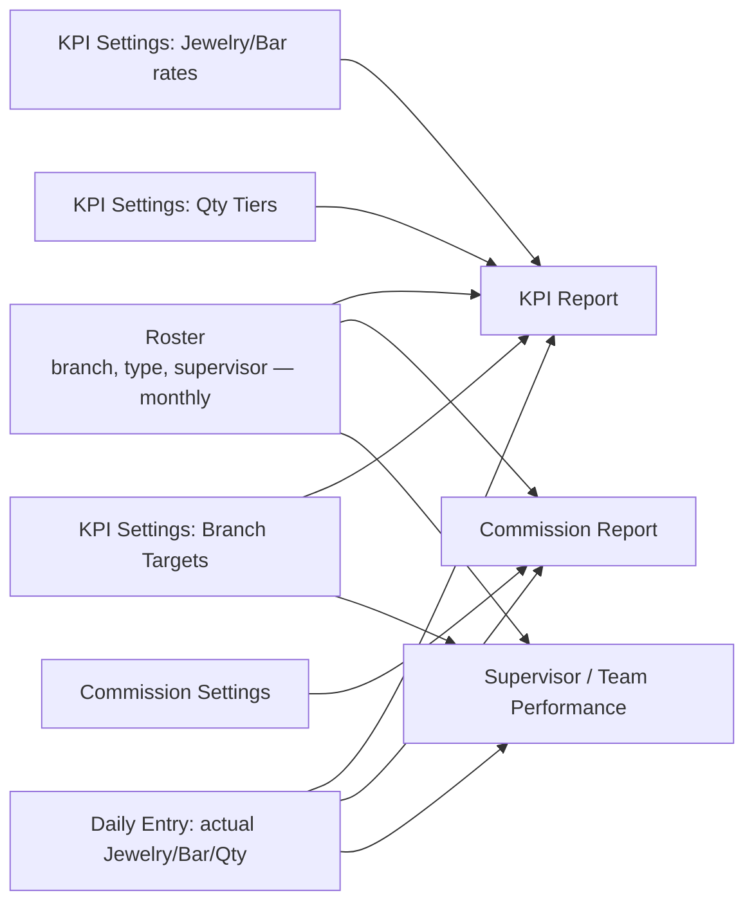

# 4. Modules, Data Links, and How KPI Is Calculated

## Module map (which file does what)

| Module | File(s) | Responsibility |
|---|---|---|
| Auth | `electron/ipc/auth.ts` | Login, sessions, user CRUD, permissions |
| Roster | `electron/ipc/roster.ts`, `electron/ipc/upload.ts` (bulk upload) | Who works where, monthly history |
| Roster history engine | `electron/db/history.ts` | The "as of month X" time-travel logic, for both reps and supervisors |
| KPI Settings | `electron/ipc/kpi.ts` | Jewelry/Bar rates, Qty tiers, branch targets — both Defaults (Admin) and monthly (HR) |
| Commission | `electron/ipc/commission.ts` | Commission rates per type, supervisor share, commission report |
| Daily Entry upload | `electron/ipc/upload.ts` | Validates + inserts daily sales rows, enforces branch lock + duplicate block |
| Reports | `electron/ipc/reports.ts` | All the report queries — Executive, Team Performance, Commission report |
| Google Sheets sync | `electron/ipc/sheets.ts` | Push/pull every tab, full wipe-and-reconnect logic |
| Frontend screens | `src/screens/*` | One folder per menu item |

## Data links — what feeds what



Every box on the left is **month-stamped**. A report for May only ever reads May's version
of each box — never "whatever's current today."

## The KPI score formula

For one rep, one month:

```
Jewelry Score = Actual Jewelry Weight (g) × Jewelry Points-per-gram (for that branch+type+month)
Bar Score     = Actual Bar Weight (g)     × Bar Points-per-gram     (for that branch+type+month)
Qty Score     = Actual Qty (pcs) × Tier Multiplier
                (which tier? the highest threshold the actual qty reaches or exceeds,
                 for that branch+type+month's tier table)

Total Score   = Jewelry Score + Bar Score + Qty Score
KPI %         = Total Score ÷ Branch Point Target (for that branch+type+month) × 100
```

### Rate/target lookup priority (most specific wins)

1. This exact branch + this exact month
2. This exact branch + standing default (no month override set)
3. Global (no branch) + standing default

If HR never sets a specific rate for a month, it silently falls back through this chain —
the app never errors, it just uses the most specific value available.

## Commission formula

```
Rep Commission = (Jewelry Baht × Jewelry Rate) + (Bar Baht × Bar Rate) + (Qty × Qty Rate)
                  — rate depends on B2C or B2B, for that month (or the nearest earlier
                    month that has a rate, if this exact month was never set)

Supervisor Commission = (sum of their team's Rep Commission) × Supervisor Share %
                         — B2C teams use the B2C share %, B2B teams use the B2B share %
```

## Supervisor KPI target formula

```
Headcount       = number of active reps under this supervisor, this month (from Roster)
Supervisor Target = sum of each rep's own Branch Point Target
                     (their individual override if one is set, else the
                      branch+type+month default — same fallback Rep KPI% already used)
Supervisor Actual  = sum of all those reps' Total Score (from the formula above)
Supervisor KPI %   = Supervisor Actual ÷ Supervisor Target × 100
```

## Why a rep transfer mid-month doesn't break history

Daily Entry rows are stamped with the branch/type that was true **on the day of the sale**,
not whatever the rep's current roster says. So if someone moves from MM to VT on June 15,
their June 1-14 sales still count toward MM, and June 15+ counts toward VT — automatically,
no manual splitting needed.
